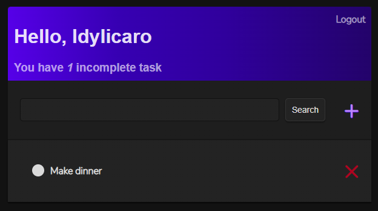

<div align="center" id="top"> 
  

  &#xa0;

  <!-- <a href="https://todoappdjango.netlify.app">Demo</a> -->
</div>

<h1 align="center">Todo App Django</h1>

<p align="center">
  

  

  

  

  <!--  -->

  <!--  -->

  <!--  -->
</p>

<!-- Status -->

<!-- <h4 align="center"> 
	🚧  Todo App Django 🚀 Under construction...  🚧
</h4> 

<hr> -->

<p align="center">
  <a href="#dart-about">About</a> &#xa0; | &#xa0; 
  <a href="#sparkles-features">Features</a> &#xa0; | &#xa0;
  <a href="#rocket-technologies">Technologies</a> &#xa0; | &#xa0;
  <a href="#white_check_mark-requirements">Requirements</a> &#xa0; | &#xa0;
  <a href="#checkered_flag-starting">Starting</a> &#xa0; | &#xa0;
  <a href="#memo-license">License</a> &#xa0; | &#xa0;
  <a href="https://github.com/idylicaro" target="_blank">Author</a>
</p>

<br>

## :dart: About ##

Um simples TODO list com conta para salvar a suas tarefas. Este projeto é voltado para estudo, onde eu aprofundo meus conhecimentos sobre, Django, CSS, Segurança, Deploy, Heroku.

A simple TODO list with an account to save your tasks. This project is study oriented, where I deepen my knowledge about Django, CSS, Security, Deploy, Heroku.

## :sparkles: Features ##

:heavy_check_mark: Create User;\
:heavy_check_mark: Authenticate User;\
:heavy_check_mark: Create, Update, Delete tasks;\
:heavy_check_mark: Search Tasks;

## :rocket: Technologies ##

The following tools were used in this project:

- [Python](https://www.python.org/)
- [Django](https://www.djangoproject.com/)


## :white_check_mark: Requirements ##

Before starting :checkered_flag:, you need to have [Git](https://git-scm.com) and [Python](https://www.python.org/) installed.

## :checkered_flag: Starting ##

```bash
# Clone this project
$ git clone https://github.com/idylicaro/todo-app-django

# Access
$ cd todo-app-django

# Linux
sudo apt-get install python3-venv # If needed
python3 -m venv .venv
source .venv/bin/activate

# macOS
python3 -m venv .venv
source .venv/bin/activate

# Windows
py -3 -m venv .venv
.venv\scripts\activate

# Install requiriments
$ python -m pip install -r requirements.txt

# Run server
$ python manage.py runserver

```

## :memo: License ##

This project is under license from MIT. For more details, see the [LICENSE](LICENSE.md) file.


Made with :heart: by <a href="https://github.com/idylicaro" target="_blank">Idyl Ícaro</a>

&#xa0;

<a href="#top">Back to top</a>
